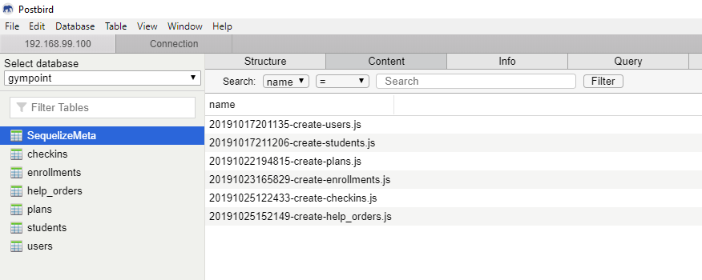
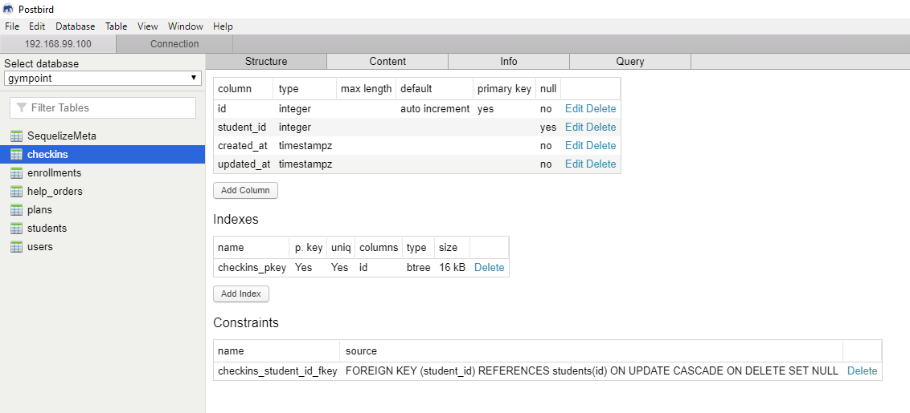
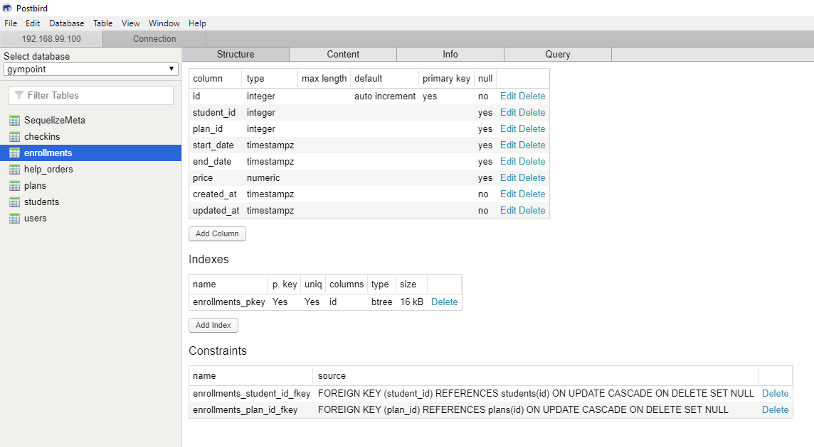
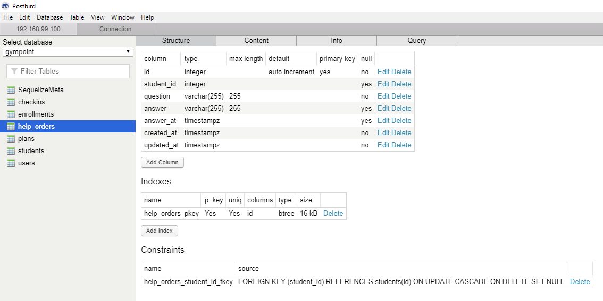
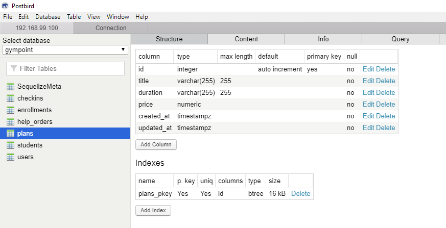
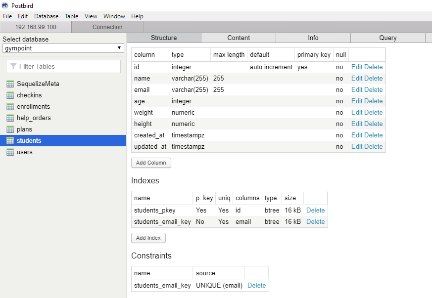
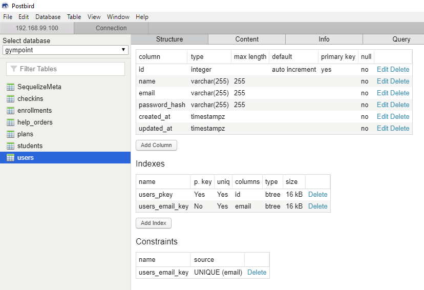

<h1 align="center">
  
</h1>

<strong> 
	Desafio 2: Gympoint, o início 
	Desafio 3: Gympoint, continuando a aplicação
</strong>

	<h2 align="center" style="color: #7159C1">Base de Dados</h2>

	<strong> SequelizeMeta</strong>

	<strong> Tabela de Check-Ins</strong>

	<strong> Tabela de Matriculas</strong>

	<strong> Tabela de Pedidos</strong>

	<strong> Tabela de Planos</strong>

	<strong> Tabela de Alunos</strong>

	<strong> Tabela de Usuários</strong>

