<h1 align="center">
  
</h1>

<strong> 
	Desafio 2: Gympoint, o início 
	Desafio 3: Gympoint, continuando a aplicação
</strong>

	<h2 align="center" style="color: #7159C1">Página Web</h2>

	<strong> Login</strong>

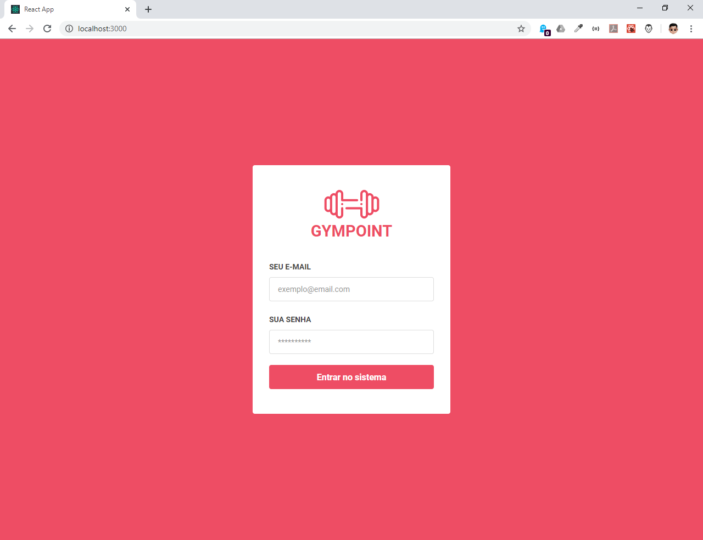

	<strong>Dashboard</strong>

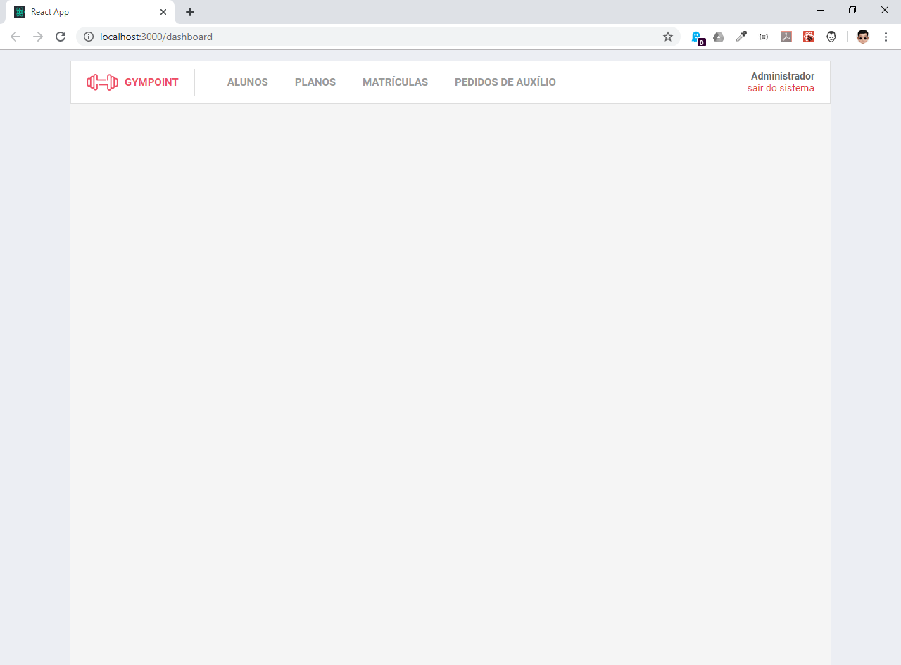

	<strong>Lista de Alunos</strong>

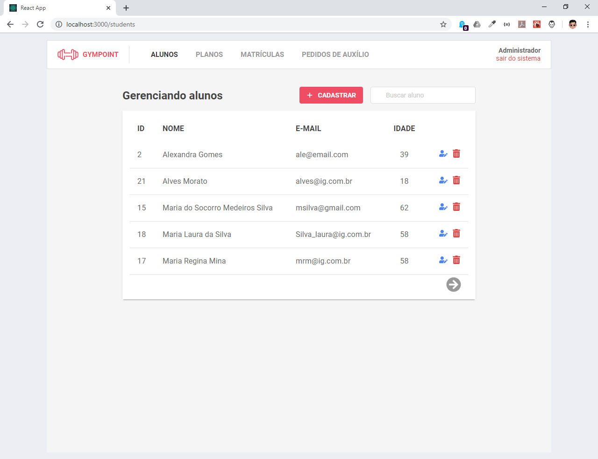

	<strong>Cadastro de Aluno</strong>

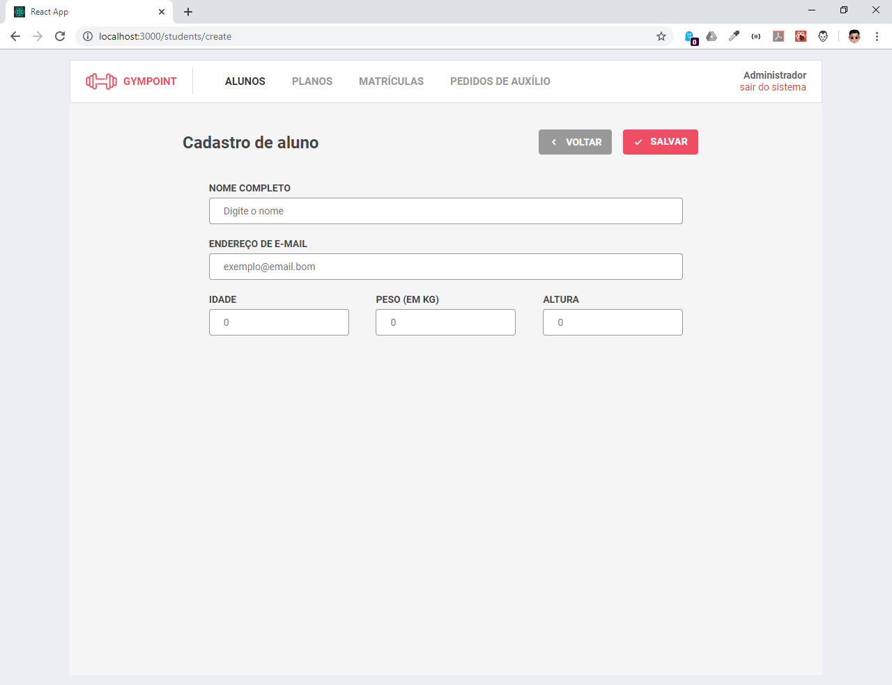

	<strong>Edição de Aluno</strong>

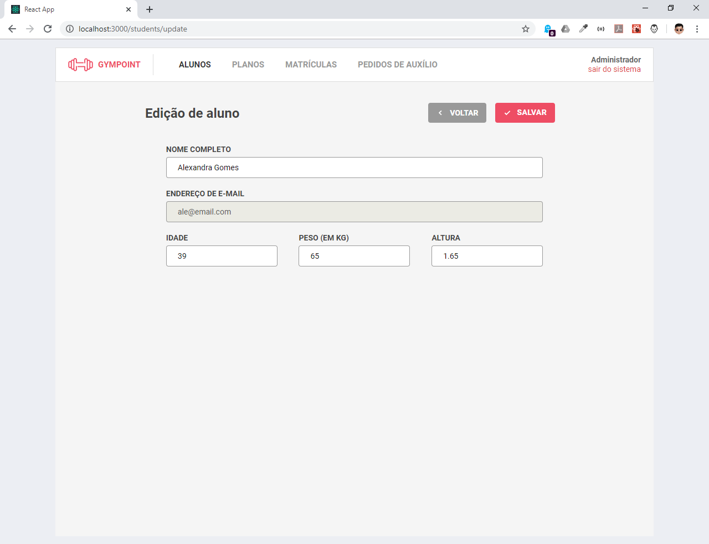

	<strong> Lista de Planos</strong>

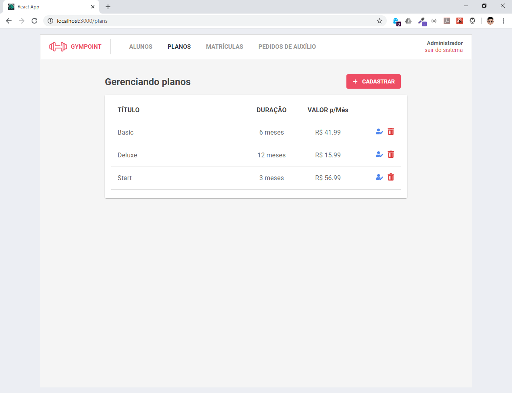

	<strong>Cadastro de Plano</strong>

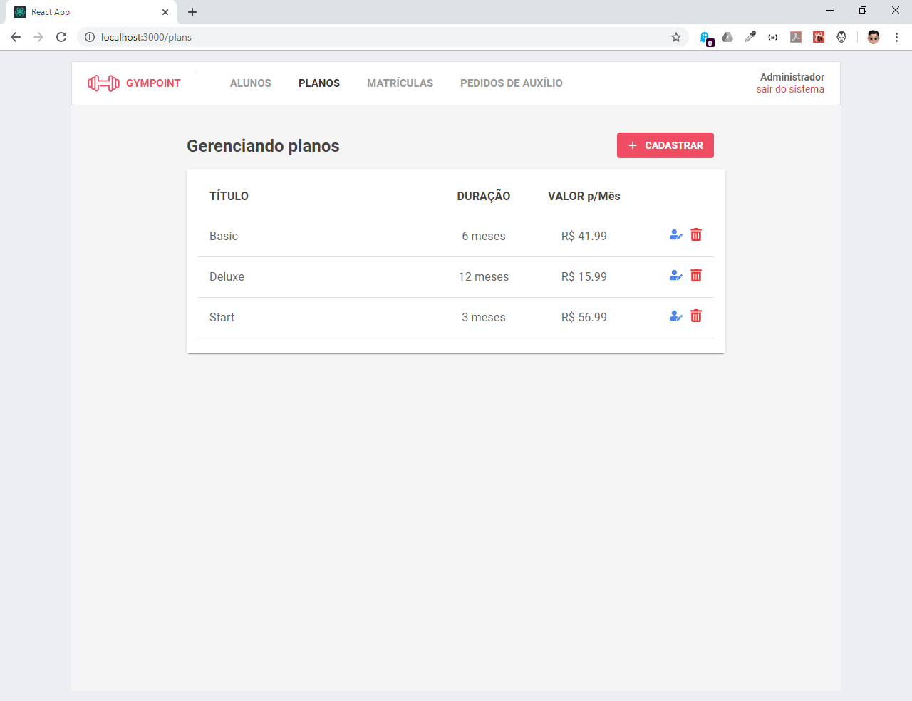

	<strong>Editando Plano</strong>

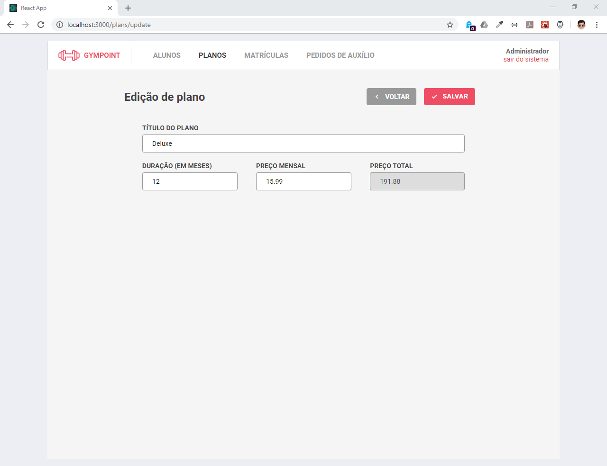

	<strong>Editando Plano</strong>

	<strong>Lista de Matriculas</strong>

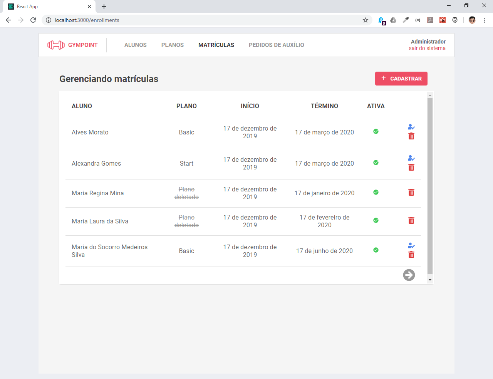

	<strong>Cadastrando Matricula</strong>

	<strong>Editando Matriculas</strong>

	<strong>Lista de Pedidos</strong>

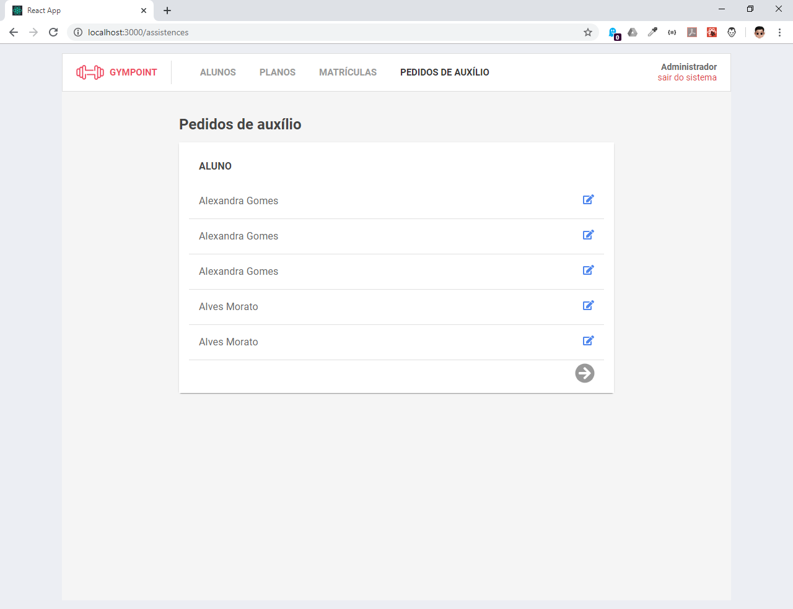

	<strong>Respondendo a Perguntas dos Alunos</strong>

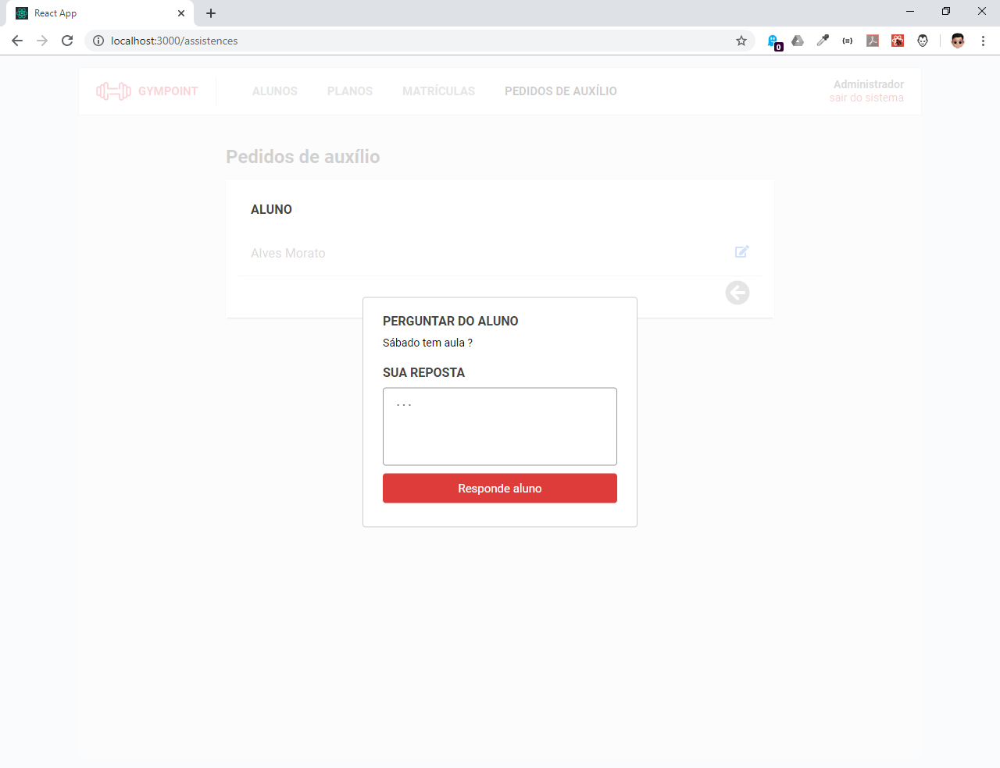

## 📝 Licença

Esse projeto está sob a licença MIT. Veja o arquivo [LICENSE](LICENSE.md) para mais detalhes.

------

