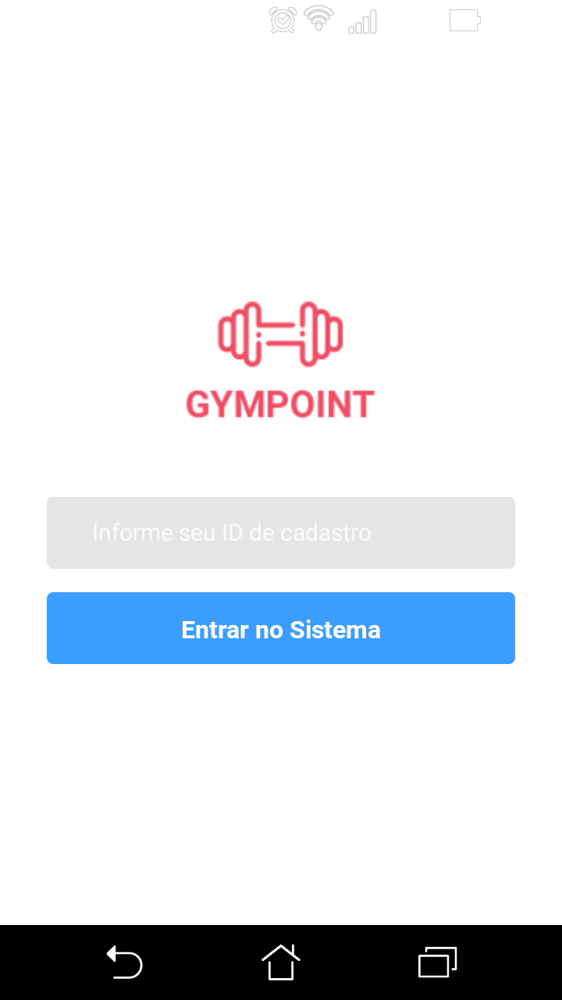
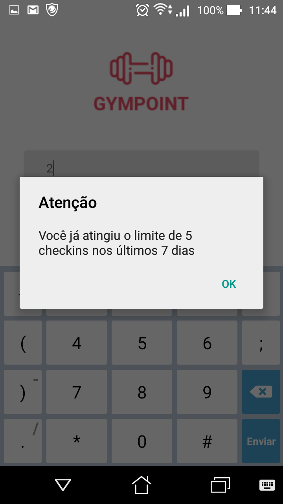
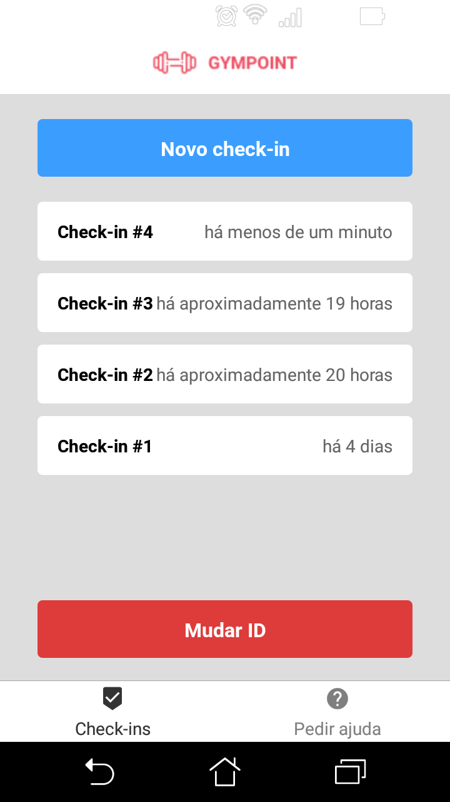
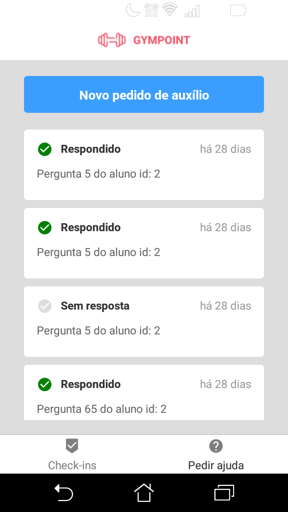
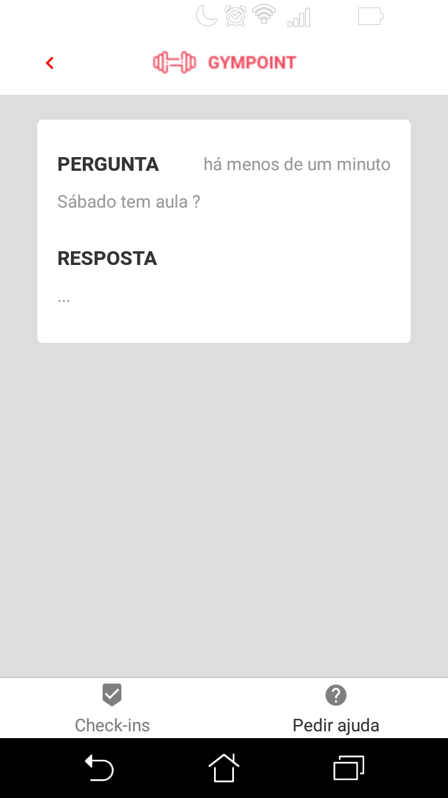
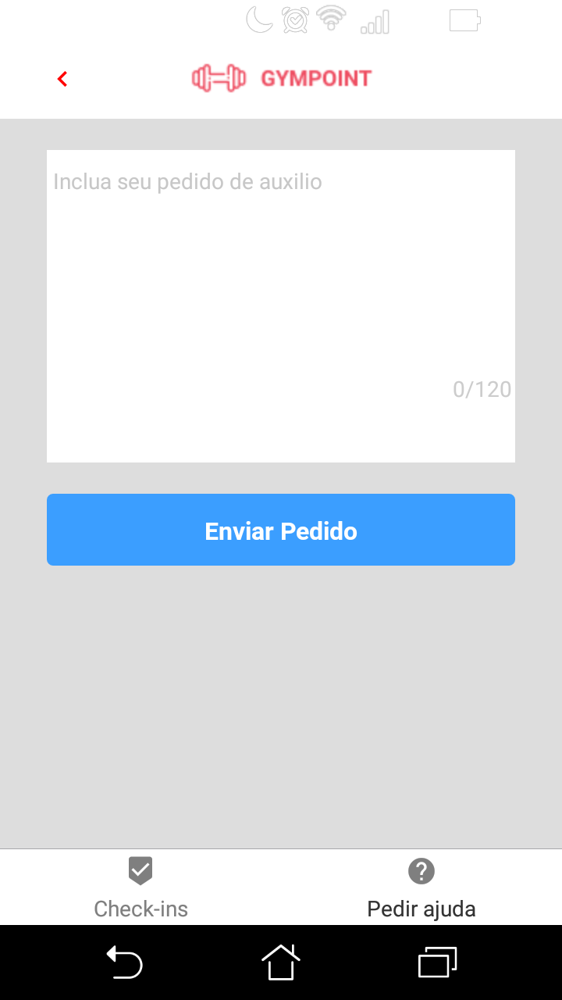

<h1 align="center">
  
</h1>

<strong> 
	Desafio 2: Gympoint, o início 
	Desafio 3: Gympoint, continuando a aplicação
</strong>

	<h2 align="center" style="color: #7159C1">Página Web</h2>

	<strong> Login</strong>

    
    

	<strong>Check-In</strong>

	<strong>Pedidos</strong>

	<strong>Resposta</strong>

	<strong>Pedindo Ajuda</strong>

## 📝 Licença

Esse projeto está sob a licença MIT. Veja o arquivo [LICENSE](LICENSE.md) para mais detalhes.

------